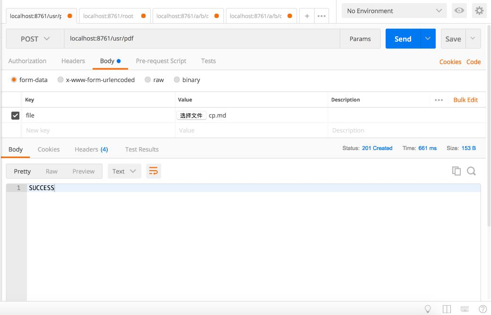
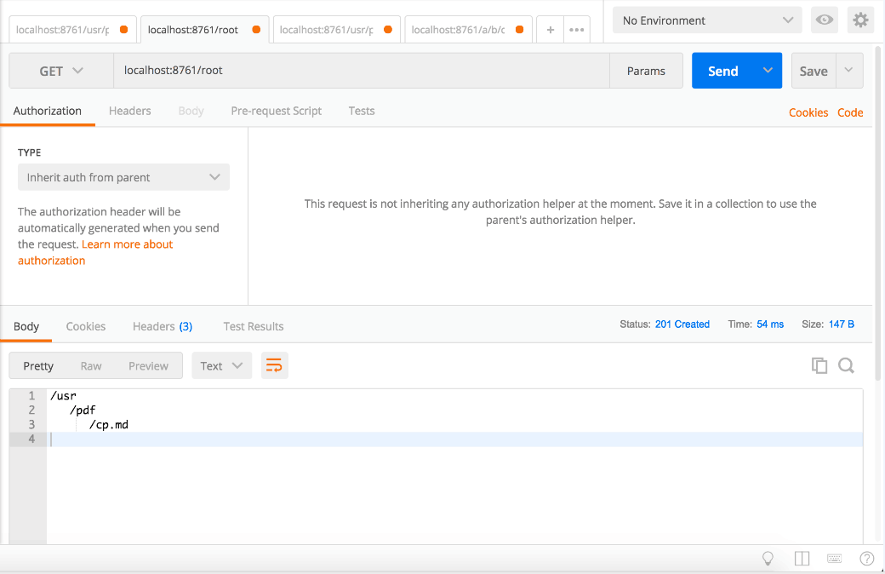
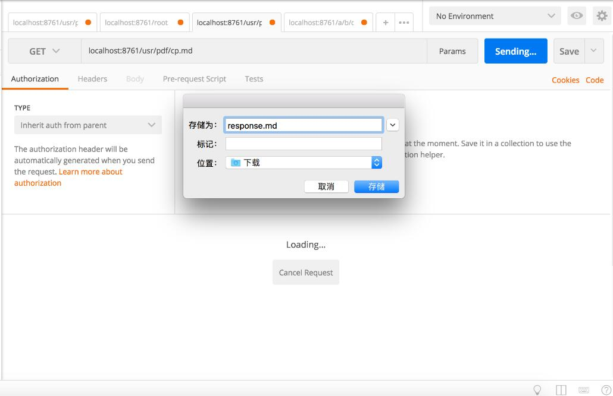
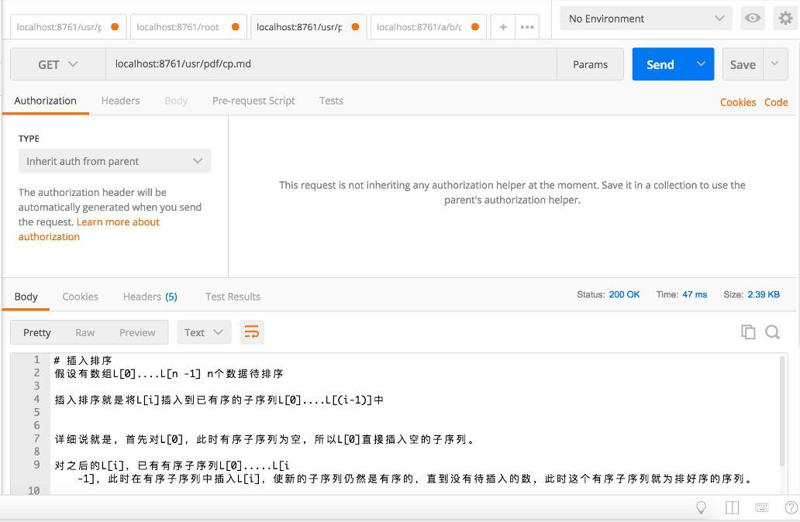
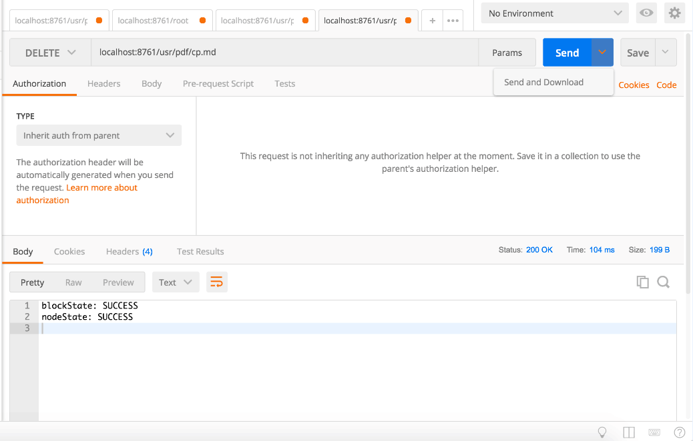

# 分布式文件系统

mdfs-namenode-server下的工程为NameNode

mdfs-datanode-server下的工程为DataNode

## 使用说明

1.NameNode可以直接启动

2.DataNode每次启动时需要更改配置文件 resources/application.yml下的server.port与
spring.application.name，想要启动不同的实例需要给每一个节点配置不同的端口号跟名字。

## Eureka

NameNode为Eureka Server，可以用来发现服务

DataNode为Eureka Client，可以向Server注册服务。

## 接口

> 接口均采用RestController接口

NameNode提供了3个接口，分别为GET POST DELETE

### 1.GET

    GET ${url}/root 
    
可以用来获取文件系统的目录

    GET ${url}/${filepath} 

可以用来获取对应路径下的文件(只要该文件存在)

### 2.POST

POST用与上传文件，其参数Key为"file",Value是任意不超过10MB的文件。

    POST ${url}/${path}

可以向指定的path目录中上传文件，若目录不存在会默认创建整个路路径的目录

### 3.DELETE

    DELETE ${url}/${filepath}

可以删除filepath指定目录和文件名的文件。

## 实现截图

### 1.上传文件

### 2.获取文件目录

### 3.下载文件

这里想要用Postman下载文件需要在蓝色的Send那里点击下拉选择Send and Download。然后输入文件名和选择下载位置。

这里如果不进行保存，会在下面返回结果的Body显示文件的内容，因为这里测试的是用的文本文件，所以可以直接看到该文件的内容

### 4.删除文件

# dev-mdfs-microserver
